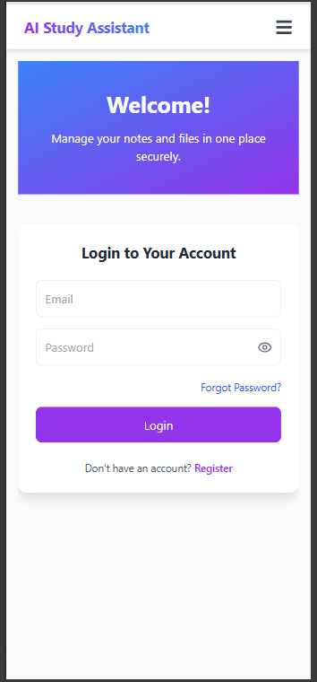
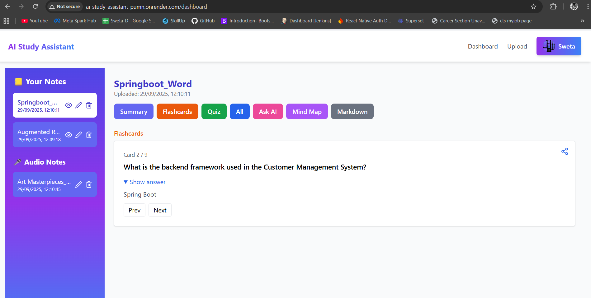
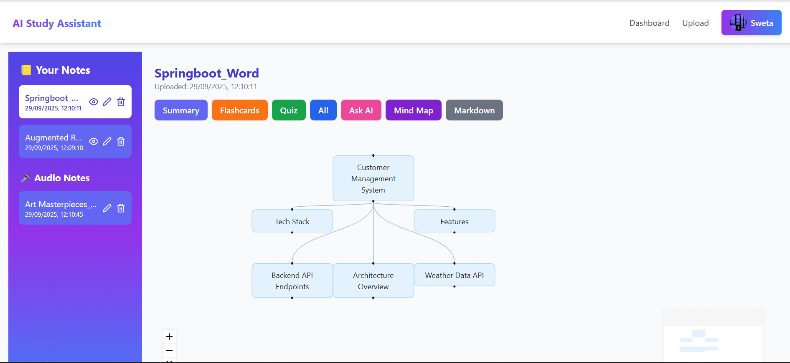
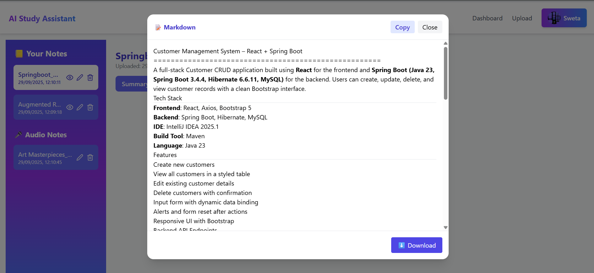
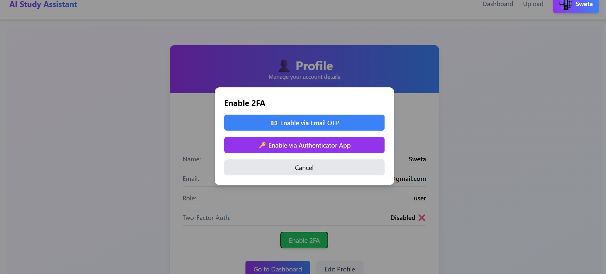
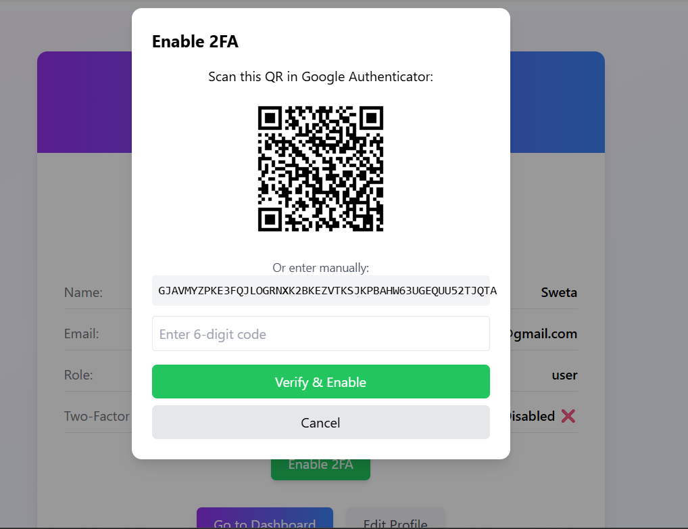
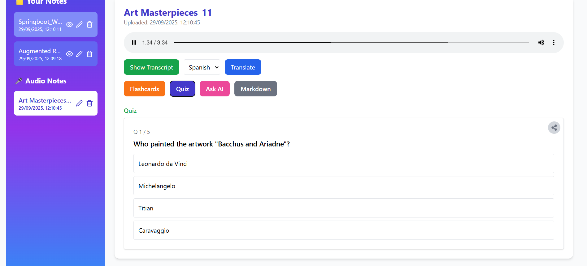

# 📚 AI Study Assistant

AI Study Assistant is a full-stack web application designed to help students **organize, manage, and optimize their study materials** using **AI-powered tools**.  

In this project, the **Groq API** serves as the backend engine to process natural language queries and generate contextual responses.  
By integrating Groq API, the application efficiently handles tasks such as answering questions, summarizing content, and providing explanations with minimal delay.  

---

## ✨ Features

### 🔐 Authentication & Security
- JWT Refresh Tokens for secure sessions  
- Forgot Password / Reset Password via email  
- Email Verification before dashboard access  
- Two-Factor Authentication (2FA) using email or authenticator apps  

### 📖 Core Learning Features
- **AI Generator** → Convert notes into MCQs, flashcards, and Markdown  
- **Voice Notes → Text** → Transcribe uploaded audio lectures  
- **Mind Maps** → Automatically generate visual maps from notes  
- **Note Sharing** → Create public or private links for notes and flashcards  
- **Ask-AI Chatbot** → Ask questions about uploaded notes and get contextual responses  

---

## 🛠 Tech Stack & Dependencies

### ⚛️ Frontend
- **Framework & Routing**: React.js, React Router  
- **HTTP & API Requests**: Axios  
- **UI & Interactivity**: Lucide React Icons, gsap, react-tooltip  
- **Content Display**: React Markdown, react-pdf  
- **Notifications & Feedback**: React Toastify  

### 🖥 Backend
- **Server & Middleware**: Node.js, Express.js, cors, dotenv  
- **Database & ORM**: MongoDB, Mongoose  
- **Authentication & Security**: JWT, bcryptjs, speakeasy  
- **Email & Notifications**: nodemailer, @sendgrid/mail  
- **File Handling**: multer, textract, pdf-parse, mammoth, qrcode  
- **AI Integration**: groq-sdk, openai  
- **Validation**: express-validator  

---

## 📸 Screenshots / Preview

  
  
  
  
  
  
  

---

## 🔗 Deployed App (Free tier)
👉 [AI Study Assistant on Render](https://ai-study-assistant-pumn.onrender.com)

---
